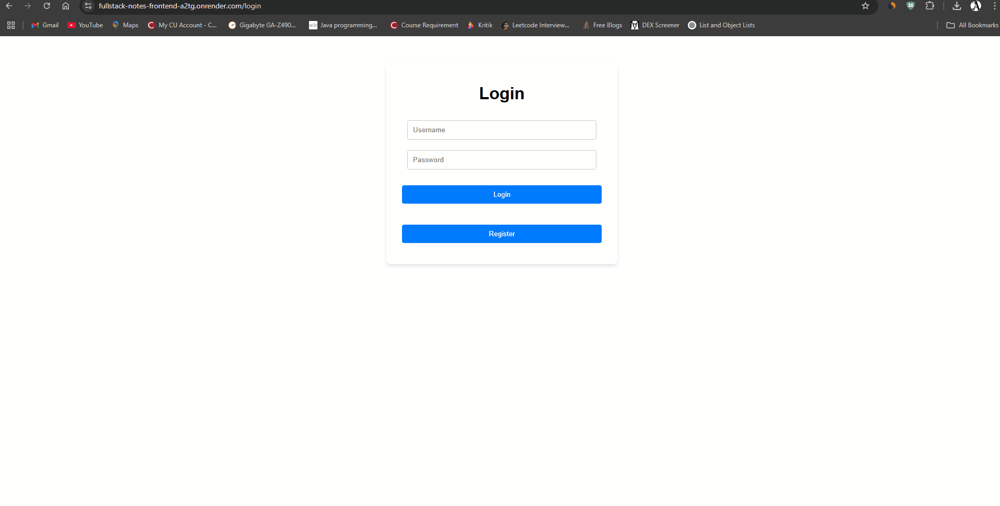

# Full Stack Notes Web Application

<a href="https://fullstack-notes-frontend-a2tg.onrender.com" target="_blank">AK Quick Notes</a> is a secure, responsive web application that allows users to **create**, **manage**, and **access** personal notes across devices. It features **JWT authentication**, **Django REST API**, and a modern **React** frontend.  

## 🚀 Tech Stack

- **Frontend:** React (JavaScript)
- **Backend:** Django (Python)
- **Database:** PostgreSQL
- **Authentication:** JWT
- **Deployment:** Render

## 🛠️ Features

- Register/Login with JWT authentication
- Create, view, and delete notes (CRUD)
- Persistent cloud storage using PostgreSQL
- Protected routes for authenticated users
- Dynamic and responsive interface



#### Setup Backend (Django)

```bash
python -m venv venv
source venv/bin/activate  # or venv\Scripts\activate on Windows
pip install -r requirements.txt
